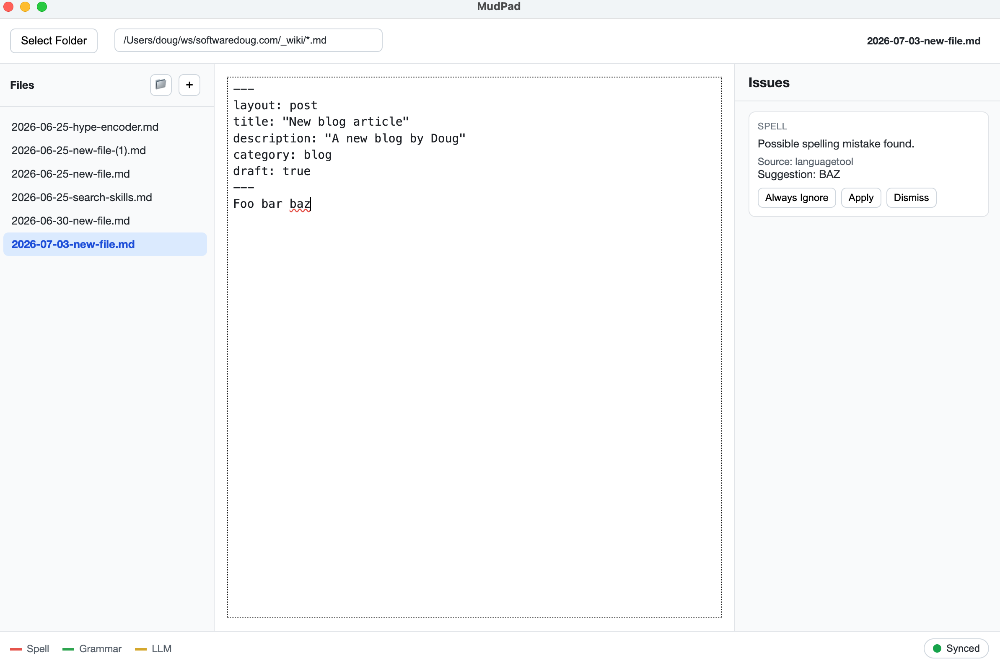

# MudPad

A git-aware markdown editor with live editing / spelling feedback from LanguageTool

Useful for static sites



Because I got tired copy pasting articles from Notion <--> Jekyll/Hugo/etc blogs

## To run

```
npm run dev
```

## To build

```
npm dist
```

Will make a dmg in release. Use that to install.
